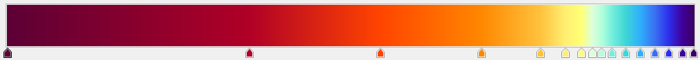

# The BlueRedRainbow colour ramp for raster visualisations
The BlueRedRainbow colour ramp was developed to be a colour rainbow for map visualisations that
also work for colour blind people. It was developed for the creation of the AIMS eReefs map visualisations. 
The final styles created are located in the [styles directory](styles). The *.pal styles are formatted to be used
by [NcAnimate2](https://github.com/aims-ks/ereefs-ncanimate2).

# Tools used
* **Microsoft PowerPoint** was used for creating the process overview diagrams. These were saved as images using a screen capture.
* **Python 3** was used for downloading the reference NetCDF files for previewing the colour ramps. This can also be done manually
using a web browser.
* **QGIS** was used to previewing the colour ramps with real eReefs data, as well as adjusting the colours in the ramps and exporting
the ramps as SLD files.
* **Notepad++** was used to copy and paste the colour ramp hex values to create the .pal format colour ramps.
* **Snagit** was used to record the video screen cast of adjusting the colour ramps.
* **Chromatic Vision Simulator** iPhone app was used to simulate colour blindness and optimise the selection of the colours in the 
blue to red transition.

# Making the rainbow colour blind compatible

We started with a traditional hue based colour ramp from purple through blue to green, yellow, orange and red. This 
ramp was then adjusted to de-emphasise green. This was done to make the colour ramp more usable for colour blind people. 
Green is difficult to differentiate from various shades of orange and red and so it is best to not have both in the 
same colour ramp. The green portions of the rainbow were shrunk by effectively skipping quickly through the green portion 
of the colour wheel. In addition to the the brightness of the rainbow was adjusted so that perceived brightness formed
a peak in the middle of the ramp. This smooth monotonic ramp of brightness helps make it easier to understand what is 
more or less in the map. It was split into an up and down brightness ramp, rather than a single ramp to increase the
level of contrast visible on the map.  

*Figure 1. Shows the process of designing the rainbow colour ramp that is suitable colour blind people*


*Figure 2. The colour ramp graphic from figure 1 viewed using a colour blindness simulator (CVSimulator app). Protanope 
on the left and tritanope on the right.*

Figure 2 shows that the middle green section of the original colour ramp is washed out when viewed with colour blindness.
The adjusted colour ramp at the bottom, shown at the bottom of the figure, shows that there is a transition in the
middle has been minimised to reduce the ambiguity in the colour ramp.

## BlueRedRainbow Rainbow colours
The BlueRedRainbow Rainbow colour ramp is made up of 16 colours. These are shown here in hex format. This colour ramp
should have perhaps be better named as PurpleBlueYellowRed as the blue end of the colours is pushed into purple.
```
#380060 
#40009a 
#2c30ee 
#3a6ef1 
#2fb0fb 
#3ed6d6 
#75eedc 
#b1ffdb 
#deffda 
#ffff75 
#ffef71 
#ffc23d
#ff8700 
#ff4400 
#b00026 
#5c0035
```

## BlueRedRainbow2 colours
This is an adjustment to the blue end of the colour ramp to stop at blue, rather than push into purple. This adjustment
was done to make maps that are predominantly 0 to look more pleasant. Using the BlueRedRainbow colour ramp results in
most of the map looking dark purple, which is less pleasant then a slightly paler blue colour. These ramp colours were 
created by removing the most purple colour then adjusting the first colour to achieve good looking maps for some of the 
BGC variables.

See later sections for the application of these colours in the Blue25Red75Rainbow2 colour ramp.
```
#1e248a
#2c30ee
#3a6ef1
#2fb0fb
#3ed6d6
#75eedc
#b1ffdb
#deffda 
#ffff75 
#ffef71 
#ffc23d
#ff8700 
#ff4400 
#b00026 
#5c0035
```

## Perceptually Uniform Colour Map - Colourmaptest
Many normal rainbow colour maps are highly uneven in their perceptual contrast. It is not uncommon to have perceptual 
flat spots where variations in the variable being visualised results in little perceived difference.

This analysis is based on [CET Perceptually Uniform Colour Maps](https://peterkovesi.com/projects/colourmaps/colourmaptestimage.html).

To test the ability to detect a small change in the underlying data the colour ramps are applied to a test image that
has a sine wave superimposed on the ramp. If the colour ramp contains perceptual flat spots then these will appear
as regions where the sine wave is less obvious.

 


Applying a rainbow colour ramp with full colour saturation shows that even with full colour vision, certain parts of the 
ramp in blue, green and red have perceptual flat spots. 


The new BlueRedRainbow colourmap has a much more consistent level of contrast across the whole ramp.


## Mapping the colour ramp to visualisation variables
The spacing of these colours were adjusted to highlight ecologically
relevant thresholds for key variables. This stretched colour ramp was then mapped to a linear set of colours to make
it compatible with setting up colour ramps in the NcAnimate tool.


*Figure 3. The position of the base colour ramp colours are adjusted for key variables. This ramp is then converted to
a linear ramp with a fix number (50) of colours.* 

## Colour ramp adjustment in QGIS

### Step 1 download the reference NetCDF data
The stretching of the colour ramps was optimised using QGIS to visualise the colour ramp with sample eReefs data. 
the 1-download-ereefs-netcdf.py Python script download the sample data used in QGIS. Alternatively you can simply 
download the following using a web browser. 
* [2020-02 Hot month](http://data.aims.ereefs.org.au/thredds/fileServer/derived-download/gbr4_v2/daily-monthly/daily-monthly-2020-02.nc)
* [2019-08 Cold month](http://data.aims.ereefs.org.au/thredds/fileServer/derived-download/gbr4_v2/daily-monthly/daily-monthly-2019-08.nc)
* [2019-02 Wet month](http://data.aims.ereefs.org.au/thredds/fileServer/derived-download/gbr4_v2/daily-monthly/daily-monthly-2019-02.nc)
* [2019-08 Smooth currents](http://data.aims.ereefs.org.au/thredds/fileServer/derived-download/gbr4_v2/monthly-monthly/monthly-monthly-2019-08.nc)

These should be saved to C:\temp\ereefs, so the paths in the QGIS project file will work without any adjustments.

### Step 2 
Once the reference data is loaded into QGIS, modify the Layer Properties and set the Render Type to 
```Singleband pseudocolour```, set the Band to show 1.5m depth data, create a custom Color ramp using the BlueRedRainbow
colours. Then set the Mode to be ```Equal Interval```, set the number of classes to be 50. The spacing of the colours
in the colour ramp can then be optimised for the variable. Once this is all done use the Style/Save Style... option to
save the result as an SLD file.


A video showing the process is available: colour-ramp-adjustment-workflow.mp4

### Temperature
For example for the temperature variable the transition from blue/green to yellow/orange was chosen to occur at 29 deg 
C, the temperature that thermal stress (and bleaching) tends to occur. This was achieved by picking a lower temperature 
bound to show winter temperatures and an upper bound to show peak summer temperatures, then adjusting the positioning of 
the colours in the ramp so that the colour transition blue to orange occurred at 28.5 deg C.

This makes the Blue to Red transition point 60% through the colour ramp and so this ramp could also be called
Blue60Red40Rainbow.

This colour ramp is optimised for a range of 20 - 34 deg C.


The linear colour ramp values for this variable are available in styles/temperature-20-34-ncwms.txt as well as in SLD 
format and QGIS format (qml).

### Salinity
Another example is that for salinity the colour ramp spacing was adjusted to highlight multiple things. Normal sea water
around the GBR and Coral Sea has a salinity in a narrow range from 35 - 35.8 PSU, however during flood events the salinity
can drop significantly in flood plumes to below 28 PSU in large areas. Additionally corals can experience fresh water
stress that can lead to bleaching if they are exposed to low salinity (<28 PSU) for extended periods of time. The rate
of bleaching is dependant on how fresh the water is and so showing the salinity down to 24 PSU allows the degree of 
stress to be assessed. It is therefore a goal of the visualisation to show by detail in the normal sea water conditions 
and in flood conditions, highlighting that there is a ecologically relevant soft transition around 28 PSU and for
the ramp to continue to show that the conditions are worse down to 24 PSU. 

In this colour ramp we reverse the order of the colours so that red corresponds low values of salinity.

This makes the Red to Blue transition point 84% through the colour ramp and so this ramp could also be called
Red84Blue16Rainbow.



### Current
In the eReefs visualisations the current is displayed as the magnitude (as a colour) and the direction as arrows overlaid
on the magnitude. This visualisation can not be reproduced directly from the data in QGIS as it does not have the ability
to combine the cartesian direction current vectors u and v into magnitude and direction. So to design the colour ramp
we use the monthly current magnitude (min, mean and max) to approximate the display of the final visualisation. With 
current there is no known specific ecologically relevant threshold, instead a threshold of 0.25 m/s was chosen as this
corresponds approximately to a maximum current that is safe to drive in. 

This makes the Blue to Red transition point 27% through the colour ramp and so this ramp could also be called
Blue27Red73Rainbow. This is very similar to the Blue25Red75Rainbow colour ramp except that the transition from yellow
to orange has been spread slightly to indicate that it is a soft transition. 


To recreate the current magnitude seen in the AIMS eReefs visualisations we need the magnitude of the average current.
This corresponds to the sqrt(u^2+v^2). We can calculate this in QGIS with the raster calculator. First add the `u` and `v`
attributes from the eReefs aggregation file then used the raster calculator:
```
sqrt ( "monthly-monthly-2019-08 — u@17" * "monthly-monthly-2019-08 — u@17"+
"monthly-monthly-2019-08 — v@17"*"monthly-monthly-2019-08 — v@17")
```
Save this as `C:\Temp\ereefs\monthly-monthly-2019-08-mag-av-current.tif`. Set the Output CRS to EPSG:4326. Then export this to `data\monthly-monthly-2019-08-mag-av-current.tif`
setting the file to have LZW compression. Set the Create Options to COMPRESS LZW. Remove the `u` and `v` layers from the project.

Repeat this process for the annual data.

### Wind
As with the current the magnitude of the average wind was calculate with the QGIS raster calculator.
```
sqrt ( "daily-monthly-2019-08 — wspeed_u@4" * "daily-monthly-2019-08 — wspeed_u@4"+"daily-monthly-2019-08 — wspeed_v@4" * "daily-monthly-2019-08 — wspeed_v@4" )
```


### Blue75Red25Rainbow
This colour ramp has a transition from blue to red at 75% along the colour ramp. This colour ramp can be used to 
stretch the lower end of the scale.


### Blue50Red50Rainbow
This colour ramp has a transition from blue to red at 50% along the colour ramp. This is a generic balanced colour map.


### Blue25Red75Rainbow
This colour ramp has a transition from blue to red at 25% along the colour ramp. This colour map can be used to stretch
the upper values. This is useful for variables where the values are normally low in values, but sometimes increase
to high values. Using this ramp allows the contrast in the normally low values to be retained, while also allowing
a reasonable upper range before the values are clipped. This would be suitable for visualising wind speeds as an example.


## Blue25Red75Rainbow2
This colour ramp is based on the BlueRedRainbow2 colours, with the spacing optimised for showing contrast with small values.
This was developed to visualise many of the BGC variables. Many of the BGC variables have a large range of values that
need to be seen on the maps from 0 up to ecologically relevant values and to peak values that might be 10 x bigger. 
The original Blue25Red75Rainbow colour ramp resulted in areas
in the maps that are close to zero appearing as a dark purple, which was not that pleasant. In addition the contrast 
for values near 0 was low.


Below is a comparison between the original colour ramp and the Blue25Red75Rainbow2 colour ramp. In it you can see more
detail in the small values and the background colour of the map, which mostly correspond to 0, is more blue.


# Style comparisons test
The style comparison is an experiment to determine the relative effectiveness of different stylings. It compares the
ability of people to accurate read temperature values from the rendered maps. 
`style-comparison-locations-answers_Template.xlxs` along with the `style-comparisons\XX-Temp-XX.jpg` are the files that
make up the test. The test consists of 10 images, each with 8 locations where the value needs to be read from the map. 
Someone undertaking the test needs to read the temperative values at the locations indicated by numbered circles on the maps.
These should be recorded in a copy of the `style-comparison-locations-answers_Template.xlxs` file. Once all the locations
have estimated the spreadsheet calculates the estimation error. `style-comparison-locations-answers_XX.xlxs` contains the 
results from individuals.

The maps that make up this test are created using the QGIS layout manager in `2_ereefs-colour-ramps.qgz`.

All the maps used in this style test are in the *Temperature - styling comparison test* group in QGIS. The styles applied here are:
- `Original`: `BlueRedRainbowTemp_20-34-degC`. this is the styling used in the production system as of 19 Jan 2022. It has a range from 
20 - 34.
- `Continuous`: `BlueRedRainbowTemp_20-34-degC` slightly modified. This uses the same colour ramp but has the range reduced to 
23 - 30 deg C to provide more contrast for annual temperature product. The threshold for the transition between blue and red was 
modified to line up with 28 deg C. This is a test styling only used in this test and is not used in production. Note that the 
legend styling in QGIS shows these layers with discrete steps. This was only done to fudge the legend.
- `Disrete`: This was a modified `BlueRedRainbowTemp_20-34-degC`. The colours were tweaked so that there would be discrete steps in 
clusters where there would be a jump in the hue.
The idea was that each colour band would have five tonally different values all within one hue band allowing the one degree temperature
steps to be more visible.
  1. dark blue/purple 23 - 24 
  2. blue 24 - 25
  3. light blue 25 - 26 
  4. turqoise 26 - 27
  5. yellow 27 - 28
  6. orange 28 - 29
  7. red - 29 - 30 
This style was only used for testing purposes and is not used in production.

# Style updates 19 Jan 2023 
A complete rebuild of all the eReefs visualisations products were triggered by CSIRO reuploading all
eReefs data files to NCI with different modification dates and MD5 hashes due to slight changes to the metadata.

The following tweaks to the styles were applied to the maps.

## Temperature
 - Hourly, daily, monthly: No change to the colour ramps. These should use `BlueRedRainbowTemp_20-34-degC.pal` with range 20 - 34 deg C.
 - Annual: Switch the style to `BlueRedRainbowTemp_23-30-degC.pal` and set the range to 23 - 30 deg C. This change halves the 
 range shown and picks a threshold temperature (27.5 deg C) that results in bleaching years showing orange and red.
 
## Current
 - Hourly, daily, monthly: No change. Switch to use `Blue38Red62RainbowCurrent.pal`, with a range of 0 - 1.2 m/s. This should
 be almost identifical to the previous palette. I had to reverse engineer a match since I didn't have an editable QGIS style for
 the previous `BlueRedRainbowCurrent_0_1-1-m-s.pal`.  
 - Annual: Use the `Blue38Red62RainbowCurrent.pal` colour ramp with a range of 0 - 0.6 m/s. This is to increase the visual contrast.
 
## Wind
 - Hourly, daily, monthly: Change to `Blue40Red60RainbowWind.pal` with a range of 0 - 24 m/s. This previously used Blue50Red50Rainbow which 
 set the threshold at 12 m/s. The new style shifts the transition from blue to orange close to 10 m/s. This threshold was chosen as at this
 wind speed it is sufficient to drive the surface currents in the reef matrix in the direction of the wind. In the 
 open ocean, where the oceanic currents are stronger, the wind needs to be significantly stronger.
 - Annual: `Blue40Red60RainbowWind.pal` with a range of 0 - 12 m/s. Use the same palette as the Hourly, daily and monthly, but halve the range.
 
## Salinity
No change

## Other changes 
The following are some other changes made to the AIMS eReefs products.

The following variables should be added to the GBR1 raw data
- `w` - Vertical current
- `botz` - Depth of the sea-bed. This is not a time series. This was requested by researchers.
 https://github.com/aims-ks/ereefs-definitions/blob/master/data/definitions/products/ereefs/gbr1_2.0/gbr1_2.0-raw.json
 
 The following variables should be added to the GBR4 raw data
- `botz` - Depth of the sea-bed. This is not a time series. This was requested by researchers.
 https://github.com/aims-ks/ereefs-definitions/blob/master/data/definitions/products/ereefs/gbr4_v2/gbr4_v2-raw.json
 